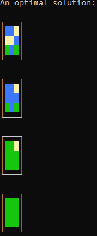

# Project overview

This is an automatic solver for the game [Kami](https://apps.apple.com/ca/app/kami/id710724007), for the app store (and Nintendo 3ds).  
The premise of the game is that the user is presented with a small grid of colored tiles.  
Each turn, they can select a tile, and change its color (as well as all adjacent tiles of the same color, 'flooding' outwards).  
The goal of the game is to turn the entire grid the same color in the minimum number of moves.

# Compilation and general usage tips

The solver is written in c++, and designed for a linux environment. It can be compiled with 'make'.  
The solver supports a colored output (using flags -c0 through -c3). This makes the input far more readable.  
Please try:
> ./kamiSolver -help

for a full list of flags!


# Sample usage

Below is a sample usage:
```
./kamiSolver -c3 -borders -auto
112
221
313
(user pressed ctrl-d)
An optimal solution:

┌───┐
│112│
│221│
│313│
└───┘

┌───┐
│112│
│111│
│313│
└───┘

┌───┐
│332│
│333│
│333│
└───┘

┌───┐
│333│
│333│
│333│
└───┘
```

The colored version can be seen below:  

